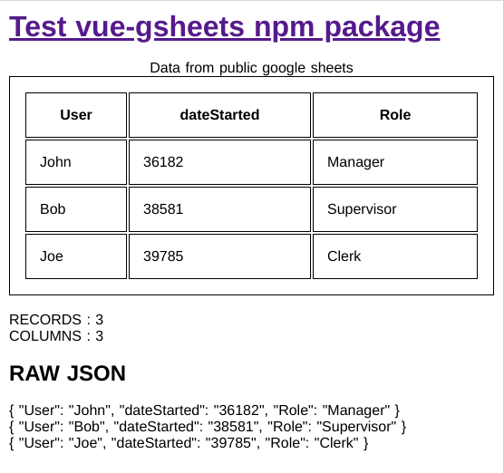

# vue-sheets

Project to test [vue-gsheets npm package](https://www.npmjs.com/package/vue-gsheets) functionality

[Google sheet used in demo](https://docs.google.com/spreadsheets/d/e/2PACX-1vQLWDoEdzvcFi5lX34b6jnyzbYqymfNXJhP4O6Xzhjsobv7gt3vn40H3fVFUwPpy-hMx0ERLQbZZh08/pubhtml)

**NOTE:** [Got issues, kindly log them here ...](https://github.com/avimehenwal/vue-sheets/issues)

## Issues

* [Missing stack frames](https://github.com/nuxt/create-nuxt-app/issues/246)
